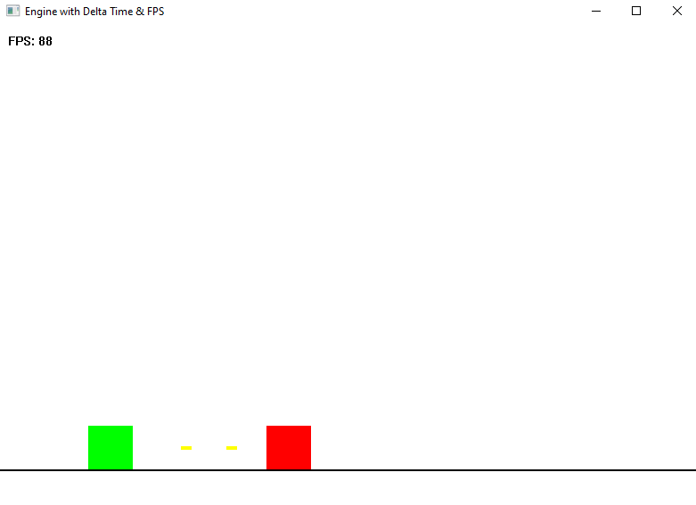

# Simple 2D Engine Prototype (WinAPI + GDI)

A lightweight 2D engine prototype built entirely with raw C++, WinAPI, and GDI — designed as a learning tool to deeply understand low-level concepts like manual game loops, high-precision time management, basic entity simulation, and native audio playback.

Built from scratch without any frameworks or external libraries to explore what truly happens under the hood in a real-time game engine.a manual game loop.

### 🔧 Features
- 🎮 Manual game loop using `PeekMessage` + `QueryPerformanceCounter`
- ⏱️ High-precision delta time and frame limiter (lock to 90 FPS)
- 📊 Real-time FPS counter drawn with `TextOut`
- 🧍 Basic entity system with types: Player, Enemy, Bullet
- 🧠 Simple physics: gravity, jumping, horizontal movement
- 💥 Collision detection between bullets and enemies
- 🔊 Sound effects for jump, shoot, and explosion using `.wav` + `PlaySound()`
- 🖱️ Keyboard input handling (Arrow keys / A, D, Space, Z)
- 🎨 Rendering via GDI (`FillRect`, `CreatePen`, `TextOut`)

### Purpose:
Designed for learning and experimentation with low-level game programming in the Windows environment — without any external libraries

---

Built by Khevin for self-learning purposes.

### Screenshot

